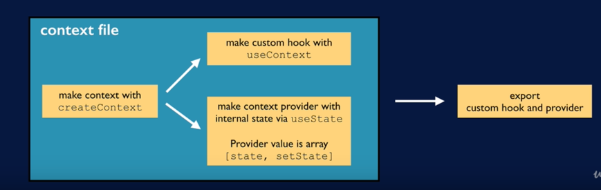
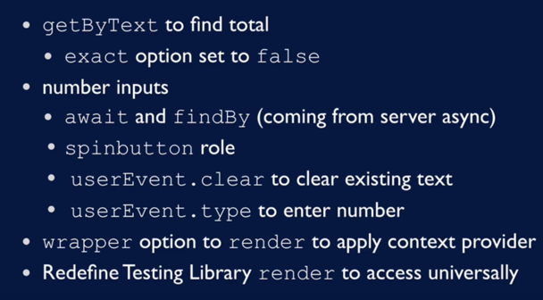
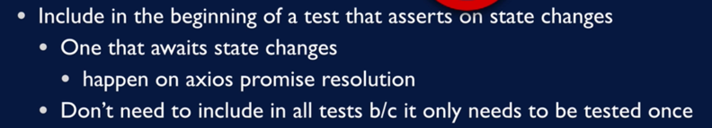
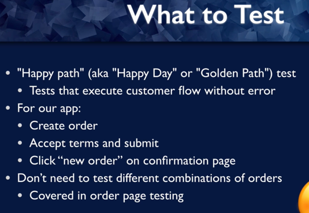
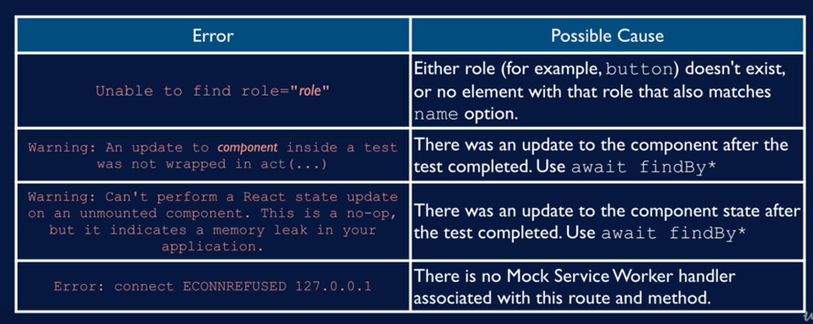

## First test with testing library
`npx create-react-app color-button`

## render()
`render`
- render
- find
- assert

```jsx
import { render, screen } from '@testing-library/react';
import App from './App';

test('renders learn react link', () => {
  render(<App />);
  const linkElement = screen.getByText(/learn react/i);
  expect(linkElement).toBeInTheDocument();
});
```

More assertion examples:
```jsx
expect(element.textContent).toBe('hello')
expect(elementsArray).toHaveLength(7);
```

DOM-based matcher

## Jest: watch mode and how tests work

React testing library:
- rendering components into virtual DOM
- searching virtual DOM
- interacting with virtual DOM

Needs a test runner:
- find tests
- run tests
- make assertions

## React testing library philosophy


## Functional testing vs Unit testing


## Testing library and accessibility
https://testing-library.com/docs/queries/byrole/

Default roles are taken into consideration e.g. <button /> has the button role without explicitly setting the role attribute.
https://www.w3.org/TR/html-aria/#docconformance
role definitions: https://www.w3.org/TR/wai-aria-1.1/#role_definitions
`getByRole(expectedRole, { name: 'The name' })`


## Start color button app
Custom matchers
https://github.com/testing-library/jest-dom
we'll use `toHaveStyle`
```jsx
test("button has correct initial color", () => {
  render(<App />);
  const colorButton = screen.getByRole('button', {name: 'Change to blue'});
  expect(colorButton).toHaveStyle({backgroundColor: 'red'})
})
```

## Test that Finds Button by Role and Clicks Button
```javascript
fireEvent.click
expect(colorButton).toHaveStyle
expect(colorButton.textContent).toBe
```
```jsx
test("button has correct initial color", () => {
  render(<App />);
  const colorButton = screen.getByRole('button', {name: 'Change to blue'});
  expect(colorButton).toHaveStyle({backgroundColor: 'red'})

  // click button
  fireEvent.click(colorButton);
  expect(colorButton).toHaveStyle({backgroundColor: 'blue'})
  expect(colorButton.textContent).toBe('Change to red')
})
```

## Test Initial Condition of Button and Checkbox
Check whether button is enabled
https://github.com/testing-library/jest-dom#tobeenabled
```javascript
expect(colorButton).toBeEnabled();
```

Whether checkbox is checked:
```javascript
  expect(checkbox).not.toBeChecked();
```

## Introduction to Code Quizzes
## Code Quiz! Confirm Button Disable on Checkbox Check

## Finding checkbox with label

## Code Quiz! Disabled Button Turns Gray

## Unit testing functions

## ESLint and prettier
https://github.com/testing-library/eslint-plugin-testing-library
https://github.com/testing-library/eslint-plugin-jest-dom
`% npm i -D eslint-plugin-testing-library eslint-plugin-jest-dom`

Schulkin's rules:
https://github.com/bonnie/bonniedotdev/blob/master/client/.eslintrc.json

## React bootstrap setup
We start new app: _sundaes_
`npm i react-bootstrap bootstrap`

User events:
https://github.com/testing-library/user-event
`npm install --save-dev @testing-library/user-event testing-library/dom`

## Screen query commands

command:
- _get_ expect element to be in DOM
- _query_ expect element not to be in DOM
- _find_ expect element to appear async

Query type:
- role
- AltText (images)
- Text (display elements)
- Form elements:
    - PlaceholderText
    - LabelText
    - DisplayValue
    
https://testing-library.com/docs/dom-testing-library/api
https://testing-library.com/docs/queries/about
https://testing-library.com/docs/dom-testing-library/cheatsheet

---

Wait for disappearing:
https://testing-library.com/docs/guide-disappearance/#waiting-for-appearance

## Testing Element is Not on Page: Start Popover Tests
```javascript
userEvent.hover(termsAndConditions)
```
```javascript
test("popover responds to hover", () => {
    render(<SummaryForm/>)
    // popover start out hidden
    const nullPopover = screen.queryByText('/no ice cream will actually be delivered/i')
    expect(nullPopover).not.toBeInTheDocument();
    // popover appears upon mouseover of checkbox label
    const termsAndConditions = screen.getByText(/terms and conditions/i)
    userEvent.hover(termsAndConditions);
    const popover = screen.getByText('/no ice cream will actually be delivered/i')
    expect(popover).toBeInTheDocument();
    // popover disappears when we mouse out
    userEvent.unhover(termsAndConditions);
    waitForElementToBeRemoved(screen.queryByText('/no ice cream will actually be delivered/i'))
})
```
## "Not wrapped in act(...)" Error, Async Disappearance
wait for disappearing asynchronously
```javascript
    await waitForElementToBeRemoved(screen.queryByText('/no ice cream will actually be delivered/i'))
```

## Introduction to Mock service worker and handlers

Install mock service worker
`npm i msw`

- create handlers
- create test server
- make sure test server listens during all tests
- reset after each test

## Set up the mock service worker server
https://mswjs.io/docs/getting-started/integrate/node

## Tests with Mock Service Worker: Scoop Options

## Using `await findBy` to Find Elements that Populate Asynchronously

## Simulating Server Error Response in Tests

## Running only Selected Tests, and `waitFor`

## Entering Text Input: Subtotal Tests

## Order details context
https://kentcdodds.com/blog/application-state-management-with-react



## Use context to display scoops subtotal

## Adding Context to Test Setup; Test Catching Error in Code
`wrapper`
```javascript
render(<Options optionType="scoops"/>, {
                wrapper: OrderDetailsProvider
        })
```

## Creating Custom Render to Wrap in Provider By Default
https://testing-library.com/docs/react-testing-library/setup/

## Review: Scoops subtotal with context



## Grand total


## Unmounted component error
confirm that test is the problem: if we skip the error disappears
```javascript
    test.skip('grand total starts at $0.00', () => {
```
Reason: component gets async updates after the test is finished
Solution:


If we don't have test to include into, we can add await to the of the test that causes error

## What Should Functional Tests Catch? and Refactor

## Order phases



## Debugging tips
```javascript
screen.debug()
```


## Jest Mock Functions as Props

