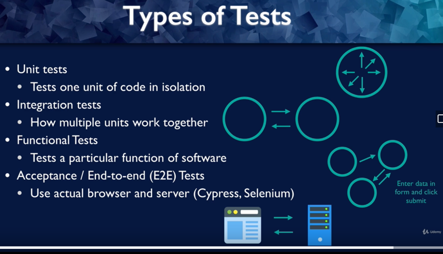
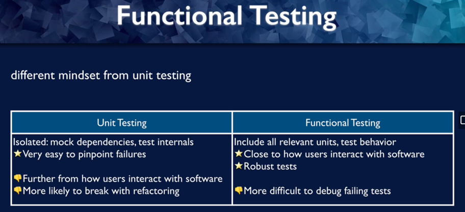

## First test with testing library
`npx create-react-app color-button`

## render()
`render`
- render
- find
- assert

```jsx
import { render, screen } from '@testing-library/react';
import App from './App';

test('renders learn react link', () => {
  render(<App />);
  const linkElement = screen.getByText(/learn react/i);
  expect(linkElement).toBeInTheDocument();
});
```

More assertion examples:
```jsx
expect(element.textContent).toBe('hello')
expect(elementsArray).toHaveLength(7);
```

DOM-based matcher

## Jest: watch mode and how tests work

React testing library:
- rendering components into virtual DOM
- searching virtual DOM
- interacting with virtual DOM

Needs a test runner:
- find tests
- run tests
- make assertions

## React testing library philosophy


## Functional testing vs Unit testing


## Testing library and accessibility
https://testing-library.com/docs/queries/byrole/

Default roles are taken into consideration e.g. <button /> has the button role without explicitly setting the role attribute.
https://www.w3.org/TR/html-aria/#docconformance
role definitions: https://www.w3.org/TR/wai-aria-1.1/#role_definitions
`getByRole(expectedRole, { name: 'The name' })`


## Start color button app
Custom matchers
https://github.com/testing-library/jest-dom
we'll use `toHaveStyle`
```jsx
test("button has correct initial color", () => {
  render(<App />);
  const colorButton = screen.getByRole('button', {name: 'Change to blue'});
  expect(colorButton).toHaveStyle({backgroundColor: 'red'})
})
```

